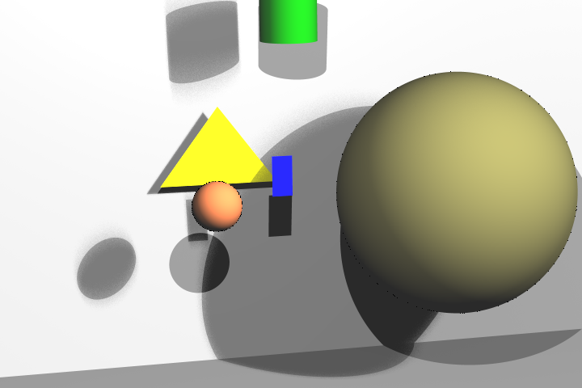

# First attempt on Ray Tracing with C++

This was my first attempt on producing imagery using code. Its nothing useful at the moment but it is implemented in 2012 with only one semester of programming experience. 

### Here is an ugly example:

Feel free to edit XML file to change world properties. All `surface`s possible are listed in sample `world.xml`. In `<light>` part `P` stand for **point light** and `A` stands for *area light*.

# Limitations

- Texture mapping does not work with XML config
- Only works with `.bmp` filetype
- Area light is actually a fake area light
	- Therefore smooth shadows only achieved through high levels of sampling values, which results in longer execution times
- Reflections and refractions does not works
- No optimizations whatsoever

# Install
Execute `./run.sh [**filename.bmp**]`

# Output
The output image will appear on `build` folder.